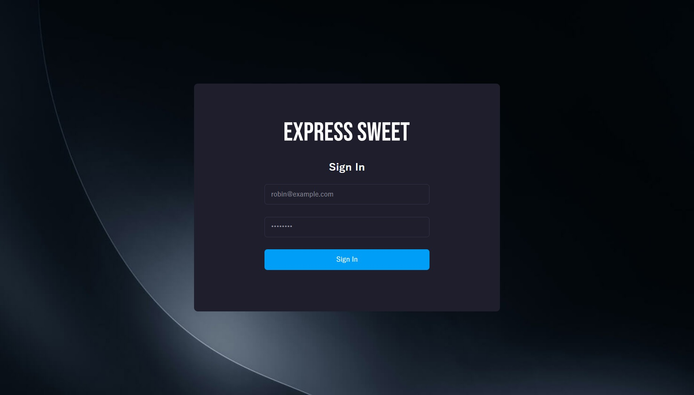
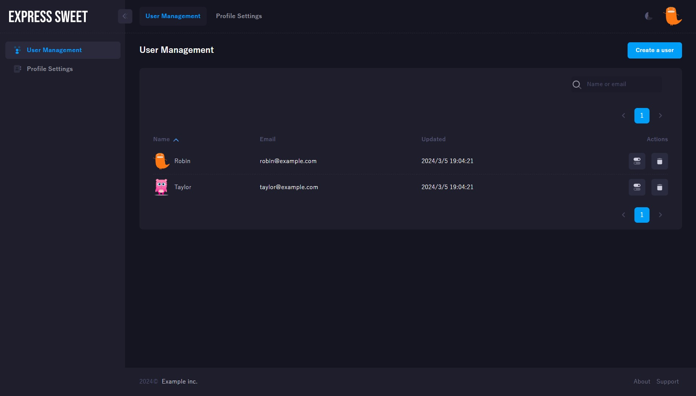
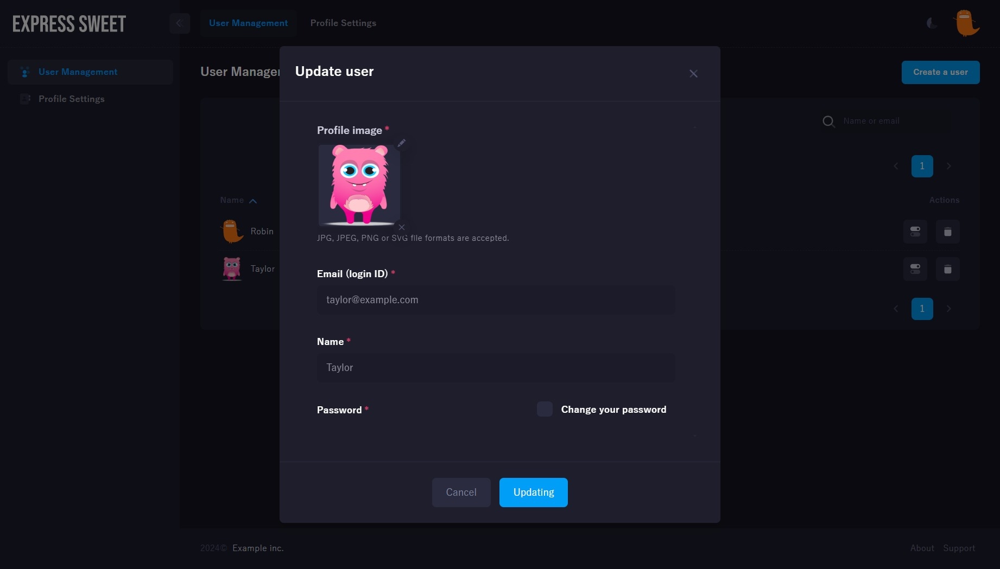
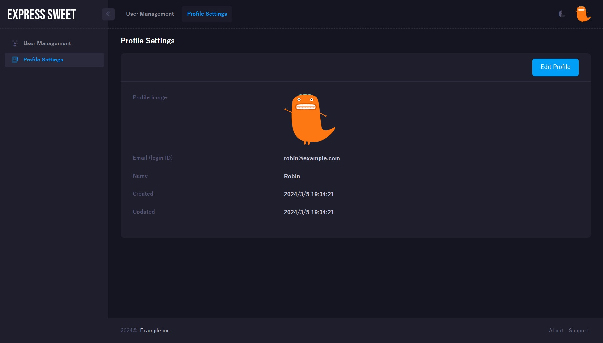

# Changelog
All notable changes to this project will be documented in this file.

## [2.0.1] - 2024/4/5
### Changed
- Removed [nodejs-shared](https://www.npmjs.com/package/nodejs-shared) package dependency.

## [2.0.0] - 2024/3/24
### Changed
- Express Sweet version 2 no longer depends on the AWS SDK.  
    The `services.AWSRekognitionClient` and `services.AWSSesClient` have been migrated to the [AWS SDK Extension](https://www.npmjs.com/package/aws-sdk-extension) NPM package, so please install from there if needed.

## [1.0.20] - 2024/3/22
### Changed
- Changed the default value of the template cookie secure attribute (`cookie_secure` in the `config/config.js` file) from true to false.  
    If `cookie_secure` is enabled, the login will always fail because no session cookie is written when the demo is run on a local server (HTTP).

## [1.0.19] - 2024/3/21
### Fixed
- The client build module (public/build) of the template was out of date, so it was updated to the latest version.

## [1.0.18] - 2024/3/6
### Changed
- Updated [metronic-extension](https://www.npmjs.com/package/metronic-extension) of templates from v1.0.1 to v3.0.9.

## [1.0.17] - 2024/3/6
### Fixed
- Fixed a typo in the name of the common JS module loaded from the template view.

## [1.0.16] - 2024/3/5
### Changed
- Changed sample DB name from `sampledb` to `express_sweet_db`.

## [1.0.15] - 2024/2/29
### Changed
- Added the ability to change color themes in template applications.
- Updated template application theme to Metronic v8.1.8.

## [1.0.14] - 2023/12/30
### Changed
- The `Secure` and `HttpOnly` attributes of the session cookie can now be set from the authentication configuration file (`config/authentication.js`).

    config/authentication.js:
    ```js
    /**
     * Specifies the boolean value for the Secure Set-Cookie attribute.
     * The default is true, which sets the Secure attribute on the cookie.
     * @type {boolean|undefined}
     */
    cookie_secure: false,
    // cookie_secure: true,

    /**
     * Specifies the boolean value for the HttpOnly Set-Cookie attribute. 
     * Defaults to true, which sets the HttpOnly attribute on the cookie.
     * @type {boolean|undefined}
     */
    cookie_httpOnly: true,
    ```

## [1.0.13] - 2023/12/30
### Changed
- The cookie name for storing session IDs can now be set in the `cookie_name` field of the authentication configuration file (`config/authentication.js`).  

    config/authentication.js:
    ```js
    /**
     * The name of the session ID cookie to set in the response (and read from in the request).
     * The default value is 'connect.sid'.
     * @type {string|undefined}
     */
    cookie_name: 'connect.sid'
    ```

## [1.0.12] - 2023/7/17
### Changed
- The beforeRender option in the view configuration (config/view.js) can now specify asynchronous functions.

### Added
- New Math-related view helpers have been added.  
    |Helper|Description|
    |--|--|
    |add|Calculates the sum of two numbers.|
    |sub|Calculates the difference of the given values.|
    |multiply|Calculate the multiplication of the given values.|
    |divide|Compute the division of the given values.|
    |ceil|Round up the value.|
    |floor|Rounds down a number.|
    |abs|Returns an absolute value.|

## [1.0.11] - 2023/7/12
### Changed
- Moved the Ajax determination option (is_ajax) in the authentication configuration (config/authentication.js) to the basic configuration (config/config.js).  
    
    config/config.js:
    ```js
    is_ajax: req => {
      // If the request URL begins with /api, it is assumed to be Ajax.
      return /^\/api/.test(req.path);
      // return !!req.xhr;
    }
    ```
- The error handle option (error_handler) in the basic configuration (config/config.js) has been removed and an option to hook error handles (hook_handle_error) added instead.  
    
    config/config.js:
    ```js
    hook_handle_error: (err, req, res, next) => {
      if (err.status === 404)
        // If the URL cannot be found, a 404 error screen (views/error-404.hbs) is displayed.
        res.render('error-404');
      else
        // For other errors, unknown error screen (views/error-unknown.hbs) is displayed.
        res.render('error-unknown');
    }
    ```

## [1.0.10] - 2023/7/11
### Changed
- The URL to redirect to when login fails (failure_redirect) option in the authentication configuration (config/authentication.js) can now be defined with a function.  
  
    config/authentication.js:
    ```js
    // Set the URL to redirect to in case of login failure as a string.
    failure_redirect: '/login',

    // Dynamically set the url to redirect to on login failure.
    failure_redirect: (req, res) => {
      // If the role stored in the cookie is admin, redirect to the admin login screen.
      return req.cookies.role === 'admin' ? '/adminlogin' : 'login';
    },
    ```
- The arguments of the failureRedirect method of the authentication service class (services/Authentication) have changed.  
    The argument to the Authentication.failureRedirect method used to be just express.Response, but now it requires express.Request and express.Response.

    Example of login routes:
    ```js
    import {Router} from 'express';
    import * as sweet from 'express-sweet';
    const router = Router();
    const Authentication = sweet.services.Authentication;

    router.post('/login', async (req, res, next) => {
      const isAuth = await Authentication.authenticate(req, res, next);
      if (isAuth)
        Authentication.successRedirect(res);
      else
        Authentication.failureRedirect(req, res);
    });
    export default router;
    ```

## [1.0.9] - 2023/6/29
### Changed
- Changed helper function names in the view (Handlebars) from SnakeCase to CamelCase.
    |After|Before|Description|
    |--|--|--|
    |notEmpty|not_empty|Check that it is not empty.|
    |formatDate|format_date|Use moment to format the date.|
    |cacheBusting|cache_busting|Returns the Assets path containing the file update time parameter.|
    |jsonStringify|json_stringify|Stringify an object using JSON.stringify.|
    |jsonParse|json_parse|Parses the given string using JSON.parse.|
    |formatBytes|format_bytes|Convert bytes to just the right units(KB, MB, GB, TB, PB, EB, ZB, YB).|

### Added
- Added view helper to convert numeric values to strings with language-sensitive representations.
    ```html
    {{number2locale 123456.789}} => 123,456.789

    {{!-- German uses comma as decimal separator and period for thousands. --}}
    {{number2locale 123456.789 'de-DE'}} => 123.456,789
    ```

## [1.0.8] - 2023/6/12
### Changed
- In the latest express-sweet v1.0.27, an express.Request object has been added to the arguments of the beforeRender function in the view configuration (config/view.js).  
    The view settings of the template have also been changed along with this update. (templates/cjs/config/view.js, templates/esm/config/view.js)  

    express-sweet v1.0.27 or later (current):
    ```js
    beforeRender: (req, res) => {}
    ```

    express-sweet v1.0.26 or earlier:
    ```js
    beforeRender: res => {}
    ```

## [1.0.7] - 2022/10/24
### Fixed
- Added is_ajax option to user authentication.

    config/authentication.js:
    ```js
    is_ajax: req => {
      // If the request URL begins with /api, it is assumed to be Ajax.
      return /^\/api/.test(req.path);
      // return !!req.xhr;
    }
    ```

## [1.0.6] - 2022/10/20
### Fixed
- A request body object has been added to the parameters of the callback function for user authentication.  

    config/authentication.js:
    ```js
    authenticate_user: async (username, password, req) => {
      const UserModel = require('../models/UserModel');
      return UserModel.findOne({
        where: {
          email: username,
          password
        },
        raw: true
      });
    }
    ```
- Removed dependent packages(aws-sdk,express,passport,passport-local,sequelize) already included in express-sweet from the template package.json.
- Template application has been updated.
    <p align="center">
      
      
    </p>
    <p align="center">
      
      
    </p>

## [1.0.5] - 2022/7/27
### Fixed
- You can now set hook functions that are called before the view is rendered.  
    Hook functions can be used, for example, to set local variables that can be used in the view.  
    
    To use, add the beforeRender hook function to "config/view.js" as follows.
    ```js
    beforeRender: res => {
      res.locals.extra = 'Extra';
    }
    ```

## [1.0.4] - 2022/5/18
### Fixed
- Version 1.0.18 of express-sweet now supports redis as session store for authentication, so we have added the relevant options (session_store, redis_host) to the authentication configuration of the template.

## [1.0.3] - 2022/5/17
### Fixed
- Fix UX of template views.

## [1.0.2] - 2022/2/13
### Fixed
- Changed the type of 'config/authentication.js#allow_unauthenticated' from'string[]' to'(string|RegExp)[]}'.

## [1.0.1] - 2021/6/10
### Fixed
- Removed packages that don't need to be installed from the template package.json.
- Added ESM template.

    Create an EJS template application:
    ```sh
    express-sweet -o esm myapp;
    ```

    Create a CJS template application:
    ```sh
    express-sweet myapp;
    # or
    express-sweet -o cjs myapp;
    ```

[1.0.1]: https://github.com/takuya-motoshima/express-sweet-generator/compare/v1.0.0...v1.0.1
[1.0.2]: https://github.com/takuya-motoshima/express-sweet-generator/compare/v1.0.1...v1.0.2
[1.0.3]: https://github.com/takuya-motoshima/express-sweet-generator/compare/v1.0.2...v1.0.3
[1.0.4]: https://github.com/takuya-motoshima/express-sweet-generator/compare/v1.0.3...v1.0.4
[1.0.5]: https://github.com/takuya-motoshima/express-sweet-generator/compare/v1.0.4...v1.0.5
[1.0.6]: https://github.com/takuya-motoshima/express-sweet-generator/compare/v1.0.5...v1.0.6
[1.0.7]: https://github.com/takuya-motoshima/express-sweet-generator/compare/v1.0.6...v1.0.7
[1.0.8]: https://github.com/takuya-motoshima/express-sweet-generator/compare/v1.0.7...v1.0.8
[1.0.9]: https://github.com/takuya-motoshima/express-sweet-generator/compare/v1.0.8...v1.0.9
[1.0.10]: https://github.com/takuya-motoshima/express-sweet-generator/compare/v1.0.9...v1.0.10
[1.0.11]: https://github.com/takuya-motoshima/express-sweet-generator/compare/v1.0.10...v1.0.11
[1.0.12]: https://github.com/takuya-motoshima/express-sweet-generator/compare/v1.0.11...v1.0.12
[1.0.13]: https://github.com/takuya-motoshima/express-sweet-generator/compare/v1.0.12...v1.0.13
[1.0.14]: https://github.com/takuya-motoshima/express-sweet-generator/compare/v1.0.13...v1.0.14
[1.0.15]: https://github.com/takuya-motoshima/express-sweet-generator/compare/v1.0.14...v1.0.15
[1.0.16]: https://github.com/takuya-motoshima/express-sweet-generator/compare/v1.0.15...v1.0.16
[1.0.17]: https://github.com/takuya-motoshima/express-sweet-generator/compare/v1.0.16...v1.0.17
[1.0.18]: https://github.com/takuya-motoshima/express-sweet-generator/compare/v1.0.17...v1.0.18
[1.0.19]: https://github.com/takuya-motoshima/express-sweet-generator/compare/v1.0.18...v1.0.19
[1.0.20]: https://github.com/takuya-motoshima/express-sweet-generator/compare/v1.0.19...v1.0.20
[2.0.0]: https://github.com/takuya-motoshima/express-sweet-generator/compare/v1.0.20...v2.0.0
[2.0.1]: https://github.com/takuya-motoshima/express-sweet-generator/compare/v2.0.0...v2.0.1