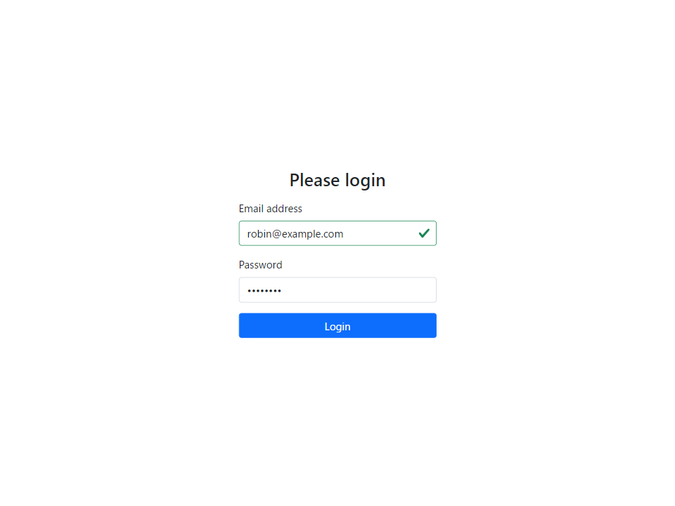
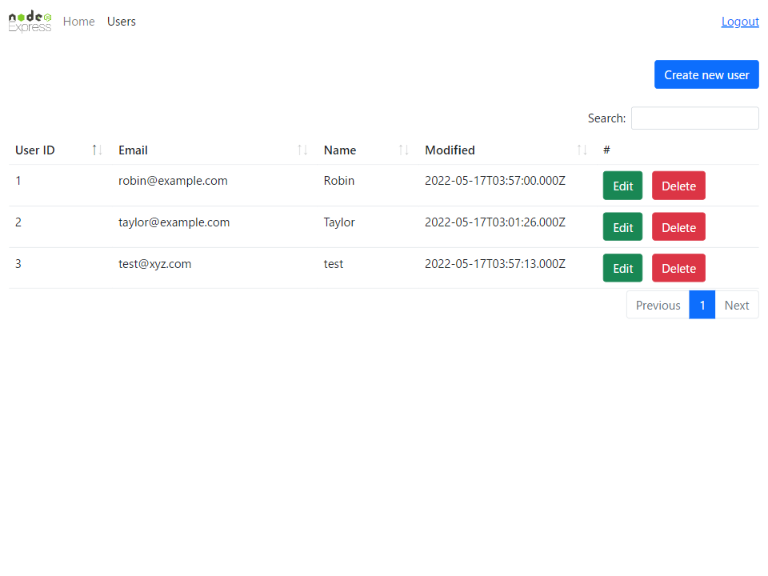
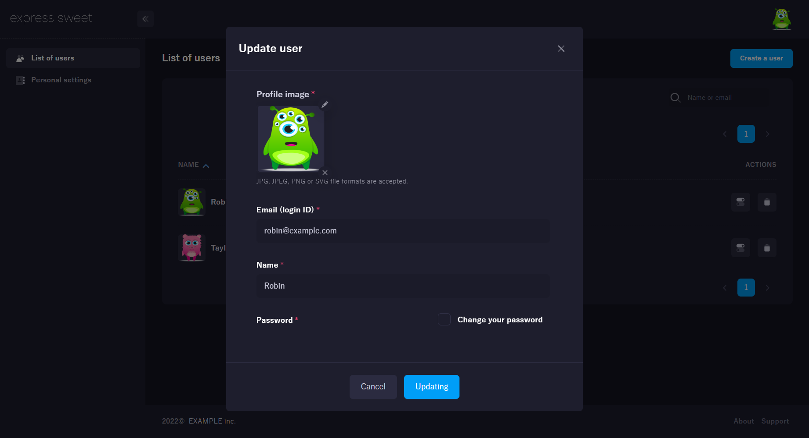
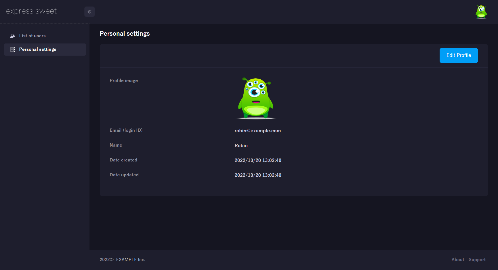

# Changelog
All notable changes to this project will be documented in this file.

## [1.0.8] - 2023/6/12
### Changed
- In the latest express-sweet v1.0.27, an express.Request object has been added to the arguments of the beforeRender function in the view configuration (config/view.js).  
    The view settings of the template have also been changed along with this update. (templates/cjs/config/view.js, templates/esm/config/view.js)  

    express-sweet v1.0.27 or later (current):
    ```js
    beforeRender: (req, res) => {}
    ```

    express-sweet v1.0.26 or earlier:
    ```js
    beforeRender: res => {}
    ```

## [1.0.7] - 2022/10/24
### Fixed
- Added is_ajax option to user authentication.
    config/authentication.js:
    ```js
    /**
    * How to determine if it is an ajax request.
    * The default is that if there is an XMLHttpRequest in the request header (req.xhr) returns true.
    * For example, if there is no XMLHttpRequest in req(express.Request) and the Ajax endpoint starts with /api, a custom Ajax decision can be made like "return /^\/api\//.test(req.path)".
    *
    * @type {(req: express.Request) => boolean}
    * @example
    * is_ajax: req => {
    *   // If the request URL begins with /api, it is assumed to be Ajax.
    *   return /^\/api/.test(req.path);
    *   // return !!req.xhr;
    * }
    */
    is_ajax: req => !!req.xhr
    ```

## [1.0.6] - 2022/10/20
### Fixed
- A request body object has been added to the parameters of the callback function for user authentication.  
    config/authentication.js:
    ```js
    const UserModel = require('../models/UserModel');

    /**
    * User authentication configuration interface.
    */
    module.exports = {
      /**
      * This hook is called when authenticating a user.
      * Please find the user information that owns the credentials based on the user name and password you received and return it.
      * If the user who owns the credentials cannot be found, return null.
      *
      * Note that the user information must include an ID value that can identify the user.
      * 
      * @type {(username: string, password: string, req: express.Request) => Promise<{[key: string]: any}|null>}
      */
      authenticate_user: async (username, password, req) => {
        return UserModel.findOne({
          where: {
            email: username,
            password
          },
          raw: true
        });
      }
    }
    ```
- Removed dependent packages(aws-sdk,express,passport,passport-local,sequelize) already included in express-sweet from the template package.json.
- Template application has been updated.
    <p align="center">
      
      
    </p>
    <p align="center">
      
      
    </p>

## [1.0.5] - 2022/7/27
### Fixed
- You can now set hook functions that are called before the view is rendered.  
    Hook functions can be used, for example, to set local variables that can be used in the view.  
    
    To use, add the beforeRender hook function to "config/view.js" as follows.
    ```js
    /**
     * Hook function just before the view is rendered.
     * For example, you can set your own local variables that can be used within the view.
     *
     * @example
     * // The message set here can be referenced in the view as {{message}}.
     * beforeRender: res => {
     *   res.locals.message = 'Hello World';
     * }
     *
     * @type {(res: express.Response) => void}
     */
    beforeRender: res => {
      res.locals.message = 'Hello World';
    }
    ```

## [1.0.4] - 2022/5/18
### Fixed
- Version 1.0.18 of express-sweet now supports redis as session store for authentication, so we have added the relevant options (session_store, redis_host) to the authentication configuration of the template.

## [1.0.3] - 2022/5/17
### Fixed
- Fix UX of template views.

## [1.0.2] - 2022/2/13
### Fixed
- Changed the type of 'config/authentication.js#allow_unauthenticated' from'string[]' to'(string|RegExp)[]}'.

## [1.0.1] - 2021/6/10
### Fixed
- Removed packages that don't need to be installed from the template package.json.
- Added ESM template.

    Create an EJS template application:
    ```sh
    express-sweet -o esm myapp;
    ```

    Create a CJS template application:
    ```sh
    express-sweet myapp;
    # or
    express-sweet -o cjs myapp;
    ```

[1.0.1]: https://github.com/takuya-motoshima/express-sweet-generator/compare/v1.0.0...v1.0.1
[1.0.2]: https://github.com/takuya-motoshima/express-sweet-generator/compare/v1.0.1...v1.0.2
[1.0.3]: https://github.com/takuya-motoshima/express-sweet-generator/compare/v1.0.2...v1.0.3
[1.0.4]: https://github.com/takuya-motoshima/express-sweet-generator/compare/v1.0.3...v1.0.4
[1.0.5]: https://github.com/takuya-motoshima/express-sweet-generator/compare/v1.0.4...v1.0.5
[1.0.6]: https://github.com/takuya-motoshima/express-sweet-generator/compare/v1.0.5...v1.0.6
[1.0.7]: https://github.com/takuya-motoshima/express-sweet-generator/compare/v1.0.6...v1.0.7
[1.0.8]: https://github.com/takuya-motoshima/express-sweet-generator/compare/v1.0.7...v1.0.8