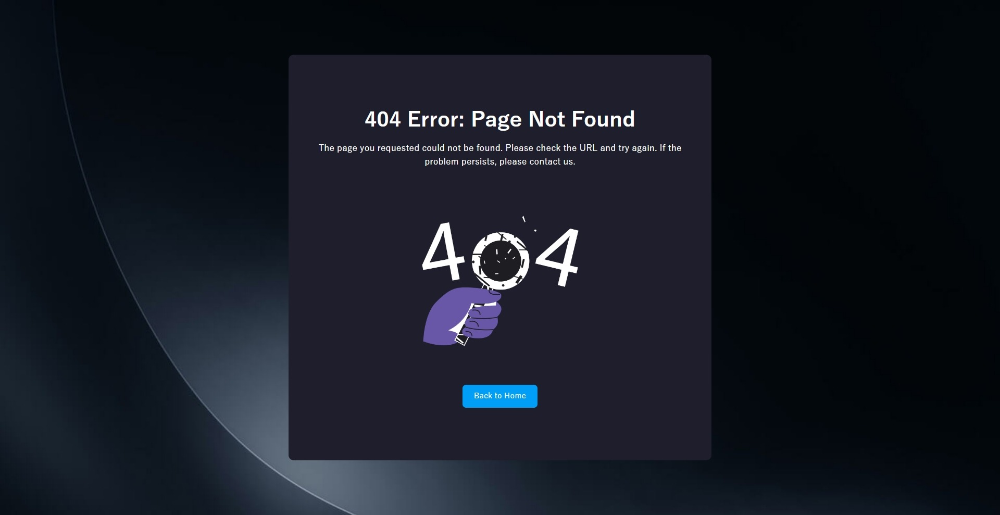

# Changelog
All notable changes to this project will be documented in this file.

<!-- ## [2.0.12] - TBD -->

## [2.0.11] - 2025/1/17
### Changed
- Added an option to `client/webpack.config.js` in the template to allow top-level await.

    `webpack.config.js`:
    ```js
    module.exports = {
      // ... other configurations ...

      experiments: {
        topLevelAwait: true,
      },

      // ... other configurations ...
    };
    ```
- Added `log_date_format: 'YYYY-MM-DD HH:mm:ss'` to `ecosystem.config.js.ejs` for ESM and CJS templates to format PM2 log messages with timestamps.
    ```javascript
    // Instead of:
    import MyModule from '../utils/MyModule.js';

    // You can now use:
    import MyModule from '#~/utils/MyModule.js';
    ```
- Added the `log_date_format` option (`YYYY-MM-DD HH:mm:ss`) to `ecosystem.config.js.ejs` for ESM and CJS templates to specify the date format for log messages in PM2, making it easier to track the time of events in the logs. 

## [2.0.10] - 2024/12/31
### Changed
- Refactored variable names used in the skeleton processing.

## [2.0.9] - 2024/12/31
### Changed
- Validation errors in request data are now logged if the `LOG_VALIDATION_ERRORS` environment variable is set to `true` (`middlewares/checkValidationResult.js`).
- Refactor the skeleton model class.

## [2.0.8] - 2024/11/21
### Changed
- Consolidated request data validation with `express-validator` into a common middleware (`middlewares/checkValidationResult.js`).
- Renamed `shard/empty` to `shard\isEmpty`.
- Change `shared/CustomValidation.js` to `validators/isValidImageDataUrl.js`.

## [2.0.7] - 2024/11/21
### Changed
- **Refactor:** Renamed the directory for storing custom error classes in the template from `exceptions` to `errors`.
- Removed `errors/UserNotFound` from the template and added a more general-purpose `errors/NotFoundError` class.

## [2.0.6] - 2024/11/18
### Changed
- Refactored variable names.
- Fixed a bug in the [user API](templates/client/src/api/UserApi.js) client module of templates.
- Frontend: Consolidated the datatable filtering logic within templates, introducing a shared function in [templates/client/src/shared/reloadDataTableWithDelay.js](templates/client/src/shared/reloadDataTableWithDelay.js).

## [2.0.5] - 2024/11/13
### Changed
- Added error page handling for 404 and 500 errors.
    - Added `isErrorPage` flag check to `views/layout/default.hbs`.
    - The side menu will not be displayed on error pages when `isErrorPage` is true.

    config/config.js:
    ```js
    hook_handle_error: (error, req, res, next) => {
      if (error.status === 404)
        res.status(404).render('errors/404', {isErrorPage: true});
      else
        res.status(500).render('errors/500', {isErrorPage: true});
    },
    ```

    Examples of error pages:
    * **404 Page (Not Found):**
        
    * **500 Page (Internal Server Error):**
        

## [2.0.4] - 2024/11/11
### Changed
- Extended [API (templates/client/src/shared/Api.js)](templates/client/src/shared/Api.js) and [Datatable (templates/client/src/shared/Datatable.js)](templates/client/src/shared/Datatable.js) classes were added to the frontend JavaScript templates.

    The login request endpoint excluded from API authentication error checks should be modified as needed according to the project.

    `client/src/shared/Api.js`:

    ```js
    /**
      * Handles API errors.
      * @param {number} code The HTTP status code.
      * @param {Error} error The error object.
      * @return {void}
      */
    errorHook(code, error) {
      // Check if the error object and request properties exist to avoid runtime errors
      if (error && error.request && error.request.responseURL) {
        const {pathname} = new URL(error.request.responseURL);
        if (pathname !== '/api/users/login' && code === 401) {
          // Redirect to the login page if an authentication error occurs on a non-login request.
          location.replace('/');
        }
      }
    }
    ```

[2.0.5]: https://github.com/takuya-motoshima/express-sweet/compare/v2.0.4...v2.0.5
[2.0.6]: https://github.com/takuya-motoshima/express-sweet/compare/v2.0.5...v2.0.6
[2.0.7]: https://github.com/takuya-motoshima/express-sweet/compare/v2.0.6...v2.0.7
[2.0.8]: https://github.com/takuya-motoshima/express-sweet/compare/v2.0.7...v2.0.8
[2.0.9]: https://github.com/takuya-motoshima/express-sweet/compare/v2.0.8...v2.0.9
[2.0.10]: https://github.com/takuya-motoshima/express-sweet/compare/v2.0.9...v2.0.10
[2.0.11]: https://github.com/takuya-motoshima/express-sweet/compare/v2.0.10...v2.0.11