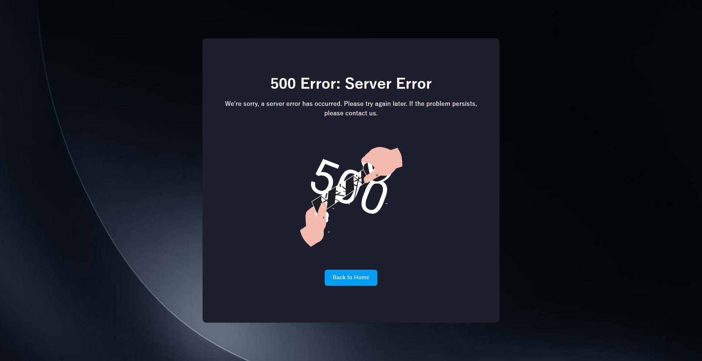

# Changelog

All notable changes to this project will be documented in this file.

## [4.0.0] - 2025-12-19

### Breaking Changes

**Express 5 Migration**
- **Requires Node.js 18.x or higher**
- Updated `express-sweet` dependency from v3.0.1 to v4.0.0
- Templates now use Express 5.2.1 (upgraded from Express 4.21.2)
- Note: `express-handlebars` remains at v7.1.3 to maintain Node.js 18+ compatibility (v8 requires Node.js 20+)
- For more details on Express 5 changes, see the [Express.js Release Notes](https://expressjs.com/en/changelog/)

**Express Sweet v4.0.0 Updates**
- `express-sweet` v4.0.0 includes middleware architecture refactoring (class-based to function-based)
- For detailed breaking changes and migration notes, see the [express-sweet CHANGELOG](https://github.com/takuya-motoshima/express-sweet/blob/main/CHANGELOG.md#unreleased)
- Note: These changes are internal to express-sweet and do not affect standard usage through the `mount()` function

### Added

**File Upload Support (Multer)**
- Added `config/upload.js` configuration file to templates for flexible file upload handling
- Support for single file, multiple files (array), and multiple field uploads
- Both memory storage and disk storage options available
- Includes comprehensive JSDoc documentation with usage examples

### Changed

**Template Updates**
- Updated route path patterns to Express 5 syntax:
  - Changed `/:userId(\\d+)` to `/^\/(?<userId>\d+)$/` in routes/api/users.js (CJS and ESM)
  - Applied to GET, PUT, and DELETE routes with regex parameter validation using named capture groups
- Added `config/upload.js` to both CJS and ESM templates with disabled default configuration

### Migration Notes

**New Projects**

Generated applications using v4.0.0+ templates will automatically use Express 5 and benefit from:
- Improved async/await error handling with automatic Promise rejection forwarding
- Updated path routing with RegExp and named capture groups for parameter validation

**Existing Projects**

To migrate existing projects to v4.0.0:

1. **Update Node.js**
   - Upgrade to Node.js 18.x or higher

2. **Update package.json dependencies**
   ```json
   {
     "dependencies": {
       "express-sweet": "^4.0.0"
     }
   }
   ```

3. **Update route path patterns with regex** (if used)
   ```js
   // Before (Express 4)
   router.get('/:userId(\\d+)', ...)

   // After (Express 5)
   router.get(/^\/(?<userId>\d+)$/, ...)
   ```

4. **Install dependencies**
   ```bash
   npm install
   ```

For more details on Express 5 breaking changes, see the [Express 5 Migration Guide](https://expressjs.com/en/guide/migrating-5.html).

## [3.0.1] - 2025-09-02

### Changed

- Added connection pool configuration examples and JSDoc documentation to database configuration template.

## [3.0.0] - 2025-08-26

### Changed

- **Breaking Change**: Updated `express-sweet` dependency from v2.0.9 to v3.0.0
  - Templates now use the new `DatabaseManager` singleton pattern instead of the deprecated `Database` class
  - All generated models automatically benefit from improved database connection management and performance
  - See the [express-sweet changelog](https://github.com/takuya-motoshima/express-sweet/blob/main/CHANGELOG.md) for detailed breaking changes

### Added

- **Logging Configuration**: Added `config/logging.js` to templates for Morgan logging configuration
  - Provides centralized logging settings with configurable format and skip options
  - Default format set to 'combined' with skip property set to undefined for all requests
  - Includes comprehensive JSDoc documentation with usage examples

### Migration Notes

Generated applications using v3.0.0+ templates will automatically use the new database architecture. No manual changes are required for new projects.

For existing projects, update your `package.json` to use `express-sweet@^3.0.0` and follow the migration guide in the [express-sweet changelog](https://github.com/takuya-motoshima/express-sweet/blob/main/CHANGELOG.md).

## [2.0.23] - 2025-08-25

### Changed

- **Security Updates**: Updated dependencies to address security vulnerabilities
  - commander: 2.15.1 → 14.0.0
  - ejs: 2.6.1 → 3.1.10
  - fs-extra: 9.1.0 → 11.3.1

- **Port Configuration Enhancement**: Modified the generated application's `package.json` to include the port specified via express-sweet-generator CLI in the nodemon start script
  - The `npm start` script now uses the port specified with the `-p, --port` option
  - Example: `express-sweet -p 4000 myapp` generates `"start": "PORT=4000 nodemon ..."`

## [2.0.22] - 2025-08-12

### Changed

- Updated `express-sweet` to v2.0.9 for latest fixes and improvements.

## [2.0.21] - 2025-07-22

### Changed

- Updated template dependencies:

  - `express`: 4.19.2 → 4.21.2  
  - `express-sweet`: 2.0.5 → 2.0.7

  See the [express-sweet](https://www.npmjs.com/package/express-sweet) changelog [here](https://github.com/takuya-motoshima/express-sweet/blob/main/CHANGELOG.md).

## [2.0.20] - 2025-02-18

### Changed

- Improved error handling in the template's API client and Datatable. Specifically, added error logging to the errorHook and ajaxErrorHook methods.

## [2.0.19] - 2025-02-09

### Changed

- Reduced container padding and increased content width on tablet and smaller screens.
- Updated metronic-extension from version 3.0.15 to ^3.0.16.
- Changed the login page background to a simple blue image.

## [2.0.18] - 2025-02-04

### Changed

- Updated express-sweet package version from 2.0.3 to 2.0.5, which the template depends on.

## [2.0.17] - 2025-02-02

### Changed

- Modified the template's validation result processing to return error messages along with HTTP status 400 when input data is invalid.

## [2.0.16] - 2025-01-31

### Changed

- Updated the Metronic extension package version from 3.0.9 to 3.0.15 for templates.

## [2.0.15] - 2025-01-30

### Changed

- Fixed front-end JS comments in templates.

## [2.0.14] - 2025-01-28

### Changed

- Fixed JSDoc and comments in the template frontend JS. 

## [2.0.13] - 2025-01-27

### Changed

- Refactored templates, endpoints, view structure, and frontend JavaScript code.

## [2.0.12] - 2025-01-19

### Changed

- Added logic to control the initial display state of the sidebar based on the sidebar minimize state (sidebar_minimize_state) stored in the cookie.

## [2.0.11] - 2025-01-17

### Changed

- Added an option to `client/webpack.config.js` in the template to allow top-level await.

    `webpack.config.js`:
    ```js
    module.exports = {
      // ... other configurations ...

      experiments: {
        topLevelAwait: true,
      },

      // ... other configurations ...
    };
    ```
- Added `log_date_format: 'YYYY-MM-DD HH:mm:ss'` to `ecosystem.config.js.ejs` for ESM and CJS templates to format PM2 log messages with timestamps.
    ```javascript
    // Instead of:
    import MyModule from '../utils/MyModule.js';

    // You can now use:
    import MyModule from '#~/utils/MyModule.js';
    ```
- Added the `log_date_format` option (`YYYY-MM-DD HH:mm:ss`) to `ecosystem.config.js.ejs` for ESM and CJS templates to specify the date format for log messages in PM2, making it easier to track the time of events in the logs. 

## [2.0.10] - 2024-12-31

### Changed

- Refactored variable names used in the skeleton processing.

## [2.0.9] - 2024-12-31

### Changed

- Refactor the skeleton model class.

## [2.0.8] - 2024-11-21

### Changed

- Consolidated request data validation with `express-validator` into a common middleware for better code reusability.
- Renamed empty check utility function to `isEmpty` for clarity.
- Reorganized custom validation functions into dedicated validators directory.

## [2.0.7] - 2024-11-21

### Changed

- **Refactor:** Renamed custom error classes directory to `errors` for better naming consistency.
- Replaced specific error classes with a more general-purpose `NotFoundError` class for flexible resource-not-found handling.

## [2.0.6] - 2024-11-18

### Changed

- Refactored variable names for better code readability.
- Fixed a bug in the user API client module.
- Frontend: Consolidated datatable filtering logic into a shared reusable function for improved maintainability.

## [2.0.5] - 2024-11-13

### Changed

- Added error page handling for 404 and 500 errors with customizable layouts.
  - Side menu is automatically hidden on error pages using the `isErrorPage` flag.
  - Error handling hook allows custom error page rendering logic.

  Examples of error pages:
  * **404 Page (Not Found):**
      
  * **500 Page (Internal Server Error):**
      

## [2.0.4] - 2024-11-11

### Changed

- Added extended API client and Datatable base classes to frontend templates for standardized error handling and data table management.
  - API client includes customizable error hooks for authentication redirects.
  - Datatable class provides reusable Ajax error handling for data tables.

[2.0.5]: https://github.com/takuya-motoshima/express-sweet-generator/compare/v2.0.4...v2.0.5
[2.0.6]: https://github.com/takuya-motoshima/express-sweet-generator/compare/v2.0.5...v2.0.6
[2.0.7]: https://github.com/takuya-motoshima/express-sweet-generator/compare/v2.0.6...v2.0.7
[2.0.8]: https://github.com/takuya-motoshima/express-sweet-generator/compare/v2.0.7...v2.0.8
[2.0.9]: https://github.com/takuya-motoshima/express-sweet-generator/compare/v2.0.8...v2.0.9
[2.0.10]: https://github.com/takuya-motoshima/express-sweet-generator/compare/v2.0.9...v2.0.10
[2.0.11]: https://github.com/takuya-motoshima/express-sweet-generator/compare/v2.0.10...v2.0.11
[2.0.12]: https://github.com/takuya-motoshima/express-sweet-generator/compare/v2.0.11...v2.0.12
[2.0.13]: https://github.com/takuya-motoshima/express-sweet-generator/compare/v2.0.12...v2.0.13
[2.0.14]: https://github.com/takuya-motoshima/express-sweet-generator/compare/v2.0.13...v2.0.14
[2.0.15]: https://github.com/takuya-motoshima/express-sweet-generator/compare/v2.0.14...v2.0.15
[2.0.16]: https://github.com/takuya-motoshima/express-sweet-generator/compare/v2.0.15...v2.0.16
[2.0.17]: https://github.com/takuya-motoshima/express-sweet-generator/compare/v2.0.16...v2.0.17
[2.0.18]: https://github.com/takuya-motoshima/express-sweet-generator/compare/v2.0.17...v2.0.18
[2.0.19]: https://github.com/takuya-motoshima/express-sweet-generator/compare/v2.0.18...v2.0.19
[2.0.20]: https://github.com/takuya-motoshima/express-sweet-generator/compare/v2.0.19...v2.0.20
[2.0.21]: https://github.com/takuya-motoshima/express-sweet-generator/compare/v2.0.20...v2.0.21
[2.0.22]: https://github.com/takuya-motoshima/express-sweet-generator/compare/v2.0.21...v2.0.22
[2.0.23]: https://github.com/takuya-motoshima/express-sweet-generator/compare/v2.0.22...v2.0.23
[3.0.0]: https://github.com/takuya-motoshima/express-sweet-generator/compare/v2.0.23...v3.0.0
[3.0.1]: https://github.com/takuya-motoshima/express-sweet-generator/compare/v3.0.0...v3.0.1
[4.0.0]: https://github.com/takuya-motoshima/express-sweet-generator/compare/v3.0.1...v4.0.0