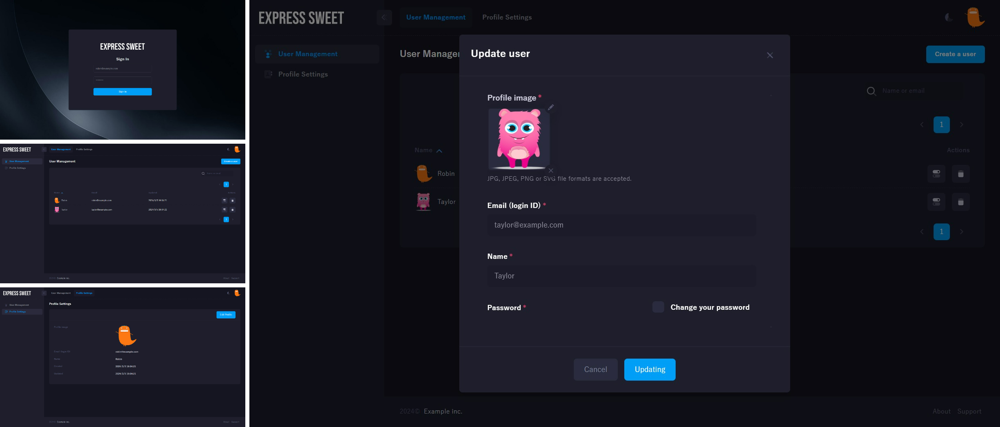

# EXPRESS SWEET Generator

**Scaffold production-ready Express.js applications in seconds.**

A powerful application generator for [EXPRESS SWEET](https://www.npmjs.com/package/express-sweet) that creates a complete, feature-rich web application with authentication, database ORM, frontend bundling, and professional project structure out of the box.

## Express 5 Ready

**Version 4.0+ generates applications with full Express 5 compatibility:**

- **Express 5.2.1** - Latest Express version with modern features
- **Node.js 18+** - Requires Node.js 18.x or higher
- **express-handlebars v7.1.3** - Maintained at v7 for Node.js 18+ compatibility (v8 requires Node.js 20+)
- **Modern Route Patterns** - Templates use RegExp with named capture groups for route validation
- **File Upload Support** - Includes `config/upload.js` for Multer configuration

For more details on Express 5 changes, see the [Express.js Release Notes](https://expressjs.com/en/changelog/).

## Table of Contents

- [Express 5 Ready](#express-5-ready)
- [Installation](#installation)
- [Quick Start](#quick-start)
- [Application Structure](#application-structure)
- [Getting Started](#getting-started-with-your-generated-application)
- [API Reference](#api-reference)
- [Command Options](#command-options)
- [Release Notes](#release-notes)
- [Author](#author)
- [License](#license)

## Installation

```bash
npm install -g express-sweet-generator
```

## Quick Start

Use the `express-sweet-generator` tool to quickly create a fully-featured application skeleton with all the essentials preconfigured.



<details>
<summary><strong>Detailed Setup Guide</strong></summary>

### 1. Generate Application

Create an Express app named `myapp`. The application will be created in a folder named `myapp` in the current working directory.

```bash
# Generate ESM (ECMAScript Modules) application
express-sweet -o esm myapp

# Or generate CJS (CommonJS) application (default)
express-sweet myapp
```

### 2. Install Dependencies

```bash
cd myapp/
npm install
```

### 3. Database Setup

The generated template uses MySQL/MariaDB as an example database. EXPRESS SWEET supports any Sequelize-compatible database (MySQL, PostgreSQL, SQLite, etc.).

Create a database with the following SQL:

```sql
-- Create database
CREATE DATABASE IF NOT EXISTS `sample_db` DEFAULT CHARACTER SET utf8mb4;

USE `sample_db`;

-- User table: Stores user account information
CREATE TABLE `user` (
  `id` int(10) unsigned NOT NULL AUTO_INCREMENT COMMENT 'Primary key',
  `name` varchar(30) NOT NULL COMMENT 'User display name',
  `email` varchar(255) NOT NULL COMMENT 'User email address (unique)',
  `password` varchar(100) NOT NULL COMMENT 'Encrypted password',
  `icon` varchar(768) NOT NULL DEFAULT MD5(RAND()) COMMENT 'User icon path or identifier',
  `created` datetime NOT NULL DEFAULT current_timestamp() COMMENT 'Record creation timestamp',
  `modified` datetime NOT NULL DEFAULT current_timestamp() ON UPDATE current_timestamp() COMMENT 'Record last modified timestamp',
  PRIMARY KEY (`id`),
  UNIQUE KEY `ukUserEmail` (`email`),
  UNIQUE KEY `ukUserIcon`(`icon`)
) ENGINE=InnoDB DEFAULT CHARSET=utf8mb4 COMMENT='User accounts table';

-- Profile table: Stores additional user profile information
CREATE TABLE `profile` (
  `id` int(10) unsigned NOT NULL AUTO_INCREMENT COMMENT 'Primary key',
  `userId` int(10) unsigned NOT NULL COMMENT 'Foreign key to user table',
  `address` varchar(255) NOT NULL COMMENT 'User address',
  `tel` varchar(14) NOT NULL COMMENT 'User telephone number',
  `created` datetime NOT NULL DEFAULT current_timestamp() COMMENT 'Record creation timestamp',
  `modified` datetime NOT NULL DEFAULT current_timestamp() ON UPDATE current_timestamp() COMMENT 'Record last modified timestamp',
  PRIMARY KEY (`id`),
  UNIQUE KEY `ukProfileUserId` (`userId`),
  CONSTRAINT `fkProfileUser` FOREIGN KEY (`userId`) REFERENCES `user` (`id`) ON DELETE CASCADE
) ENGINE=InnoDB DEFAULT CHARSET=utf8mb4 COMMENT='User profiles table';

-- Comment table: Stores user comments
CREATE TABLE `comment` (
  `id` int(10) unsigned NOT NULL AUTO_INCREMENT COMMENT 'Primary key',
  `userId` int(10) unsigned NOT NULL COMMENT 'Foreign key to user table',
  `text` text NOT NULL COMMENT 'Comment text content',
  `created` datetime NOT NULL DEFAULT current_timestamp() COMMENT 'Record creation timestamp',
  `modified` datetime NOT NULL DEFAULT current_timestamp() ON UPDATE current_timestamp() COMMENT 'Record last modified timestamp',
  PRIMARY KEY (`id`),
  CONSTRAINT `fkCommentUser` FOREIGN KEY (`userId`) REFERENCES `user` (`id`) ON DELETE CASCADE
) ENGINE=InnoDB DEFAULT CHARSET=utf8mb4 COMMENT='User comments table';

-- Book table: Stores user books
CREATE TABLE `book` (
  `id` int(10) unsigned NOT NULL AUTO_INCREMENT COMMENT 'Primary key',
  `userId` int(10) unsigned NOT NULL COMMENT 'Foreign key to user table',
  `title` text NOT NULL COMMENT 'Book title',
  `created` datetime NOT NULL DEFAULT current_timestamp() COMMENT 'Record creation timestamp',
  `modified` datetime NOT NULL DEFAULT current_timestamp() ON UPDATE current_timestamp() COMMENT 'Record last modified timestamp',
  PRIMARY KEY (`id`),
  UNIQUE KEY `ukBookTitle` (`userId`, `title`(255)),
  CONSTRAINT `fkBookUser` FOREIGN KEY (`userId`) REFERENCES `user` (`id`) ON DELETE CASCADE
) ENGINE=InnoDB DEFAULT CHARSET=utf8mb4 COMMENT='User books table';

-- Sample data insertion
INSERT INTO `user` (`id`, `email`, `password`, `name`, `icon`) VALUES
  (1, 'robin@example.com', 'password', 'Robin', '/upload/1.png'),
  (2, 'taylor@example.com', 'password', 'Taylor', '/upload/2.png');

INSERT INTO `profile` (`userId`, `address`, `tel`) VALUES
  (1, '777 Brockton Avenue, Abington MA 2351', '202-555-0105'),
  (2, '30 Memorial Drive, Avon MA 2322', '');

INSERT INTO `comment` (`userId`, `text`) VALUES
  (1, 'From Robin #1'),
  (1, 'From Robin #2'),
  (2, 'From Taylor #1');

INSERT INTO `book` (`userId`, `title`) VALUES
  (1, 'Beautiful'),
  (1, 'Lose Yourself'),
  (2, 'When Im Gone');
```

### 4. Database Configuration

Configure the database connection in `config/database.js`. For more details, refer to the [Sequelize documentation](https://sequelize.org/docs/v6/other-topics/migrations/#configuration).

**For ESM applications:**
```js
export default {
  development: {
    username: 'root',
    password: 'password',
    database: 'sample_db',
    host: 'localhost',
    dialect: 'mariadb'
  },
  test: {
    username: 'root',
    password: 'password',
    database: 'sample_db',
    host: 'localhost',
    dialect: 'mariadb'
  },
  production: {
    username: 'root',
    password: 'password',
    database: 'sample_db',
    host: 'localhost',
    dialect: 'mariadb'
  }
}
```

**For CJS applications:**
```js
module.exports = {
  development: {
    username: 'root',
    password: 'password',
    database: 'sample_db',
    host: 'localhost',
    dialect: 'mariadb'
  },
  test: {
    username: 'root',
    password: 'password',
    database: 'sample_db',
    host: 'localhost',
    dialect: 'mariadb'
  },
  production: {
    username: 'root',
    password: 'password',
    database: 'sample_db',
    host: 'localhost',
    dialect: 'mariadb'
  }
}
```

### 5. Environment Configuration

The database environment can be defined in the `.env` file:

```bash
NODE_ENV=development
```

### 6. Run the Application

Start the application:

```bash
npm start
```

### 7. Access the Application

Open your browser and navigate to `http://localhost:3000/` to access the application.

</details>

<details>
<summary><strong>Application Structure</strong></summary>

## Application Structure

The generated application has the following directory structure:

```
.
├── .env                          # Environment variables configuration
├── app.js                        # Main application entry point
├── ecosystem.config.js           # PM2 process manager configuration
├── nginx.sample.conf             # Sample Nginx reverse proxy configuration
├── package.json                  # Node.js dependencies and scripts
├── bin
│   └── www                       # Application startup script
├── client                        # Frontend application directory
│   ├── package.json              # Frontend dependencies
│   ├── webpack.config.js         # Webpack bundler configuration
│   └── src                       # Frontend source code
├── config                        # Application configuration files
│   ├── authentication.js         # Authentication and session settings
│   ├── config.js                 # Core application configuration
│   ├── database.js               # Database connection settings
│   ├── logging.js                # HTTP request logging configuration
│   ├── upload.js                 # File upload (Multer) configuration
│   └── view.js                   # Template engine configuration
├── errors                        # Custom error classes
│   └── NotFoundError.js          # Custom error definitions
├── middlewares                   # Express middlewares
│   └── checkValidationResult.js  # Validation middleware
├── models                        # Database models (Sequelize ORM)
│   ├── BookModel.js              # Book entity model
│   ├── CommentModel.js           # Comment entity model
│   ├── ProfileModel.js           # User profile model
│   └── UserModel.js              # User entity model
├── public                        # Static assets directory
│   ├── build                     # Compiled frontend assets
│   └── upload                    # User uploaded files
├── routes                        # Express route definitions
│   ├── login.js                  # Authentication routes
│   ├── profile.js                # Profile management routes
│   ├── users.js                  # User management routes
│   └── api                       # API endpoints
│       ├── profile.js            # Profile API routes
│       └── users.js              # User API routes
├── validators                    # Custom validation functions
│   └── isValidImageDataUrl.js    # Image validation
└── views                         # Handlebars template files
    ├── error.hbs                 # Error page template
    ├── login.hbs                 # Login page template
    ├── layout                    # Layout templates
    │   └── default.hbs           # Default page layout
    ├── partials                  # Reusable template components
    │   └── .gitkeep              # Placeholder for partial templates
    ├── users
    │   └── index.hbs             # Users listing template
    ├── profile
    │   ├── show.hbs              # Profile display template
    │   └── edit.hbs              # Profile editing template
    └── errors
        ├── 404.hbs               # 404 error template
        └── 500.hbs               # 500 error template
```

### Key Directories Explained

**Configuration (`config/`)**
Contains all application settings divided by functionality. Modify these files to customize database connections, authentication behavior, view rendering, logging, and file uploads.

**Models (`models/`)**  
Database entities using Sequelize ORM. Each model represents a database table and defines the schema, relationships, and business logic for that entity.

**Routes (`routes/`)**  
URL endpoint handlers organized by feature. The file structure automatically maps to URL paths - for example, `routes/api/users.js` handles requests to `/api/users`.

**Views (`views/`)**  
Handlebars templates for rendering HTML pages. The `layout/` directory contains base templates, while `partials/` holds reusable components.

**Public (`public/`)**
Static files served directly by the web server. The `build/` directory contains compiled frontend assets, while `upload/` stores user-generated content.

</details>

## Getting Started with Your Generated Application

Once your application is generated and running, you can:

1. **Explore the Features**: Visit the main framework documentation to understand routing, models, authentication, and the view system
2. **Customize Configuration**: Modify files in the `config/` directory to suit your project needs
3. **Add New Models**: Create additional models in the `models/` directory following the existing patterns
4. **Build Routes**: Add new routes in the `routes/` directory for your application logic
5. **Create Views**: Design templates in the `views/` directory using Handlebars

For detailed tutorials and advanced usage, visit the [EXPRESS SWEET Documentation](https://takuya-motoshima.github.io/express-sweet/).

## API Reference

For comprehensive documentation on using the generated application, refer to the **[EXPRESS SWEET Documentation](https://takuya-motoshima.github.io/express-sweet/)**.

The complete API reference includes:

- **[Database](https://takuya-motoshima.github.io/express-sweet/modules/database.html)**: Model classes and database management
- **[Authentication](https://takuya-motoshima.github.io/express-sweet/classes/services.Authentication.html)**: User authentication and session management  
- **[Routing](https://takuya-motoshima.github.io/express-sweet/modules/routing.html)**: Advanced routing functionality
- **[Handlebars Helpers](https://takuya-motoshima.github.io/express-sweet/modules/handlebars_helpers.html)**: Template helpers for views
- **[Configuration](https://takuya-motoshima.github.io/express-sweet/modules/interfaces.html)**: All configuration interfaces
- **[Middlewares](https://takuya-motoshima.github.io/express-sweet/modules/middlewares.html)**: Built-in middleware components

## Command Options

```bash
express-sweet [options] [dir]

Options:
  -o, --output <output>   Add output module support (esm|cjs) (defaults to cjs)
  -p, --port <port>       Application listening port (default: 3000)
  -f, --force             Force creation on non-empty directory
  -V, --version           Display version number
  -h, --help              Display help for command
```

## Release Notes

**Latest Release: v4.0.0 (2025-12-05)**

Major update with Express 5 migration and file upload support:

- **Express 5 Migration**: Upgraded to Express 5.2.1 with Node.js 18+ requirement
- **File Upload Support**: Added Multer configuration (`config/upload.js`) for flexible file handling
- **Template Updates**: Express 5 path pattern syntax for regex validation

For complete version history and migration guides, see [CHANGELOG.md](CHANGELOG.md).

## Author

**Takuya Motoshima**

* [github/takuya-motoshima](https://github.com/takuya-motoshima)
* [x/takuya_motech](https://x.com/takuya_motech)
* [facebook/takuya.motoshima.7](https://www.facebook.com/takuya.motoshima.7)

## License

[MIT](LICENSE)